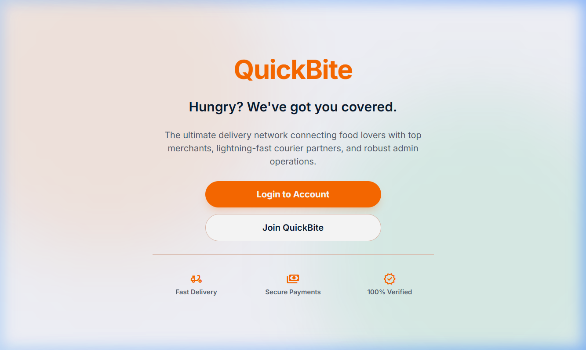
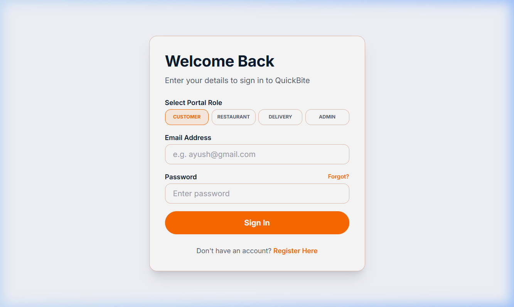
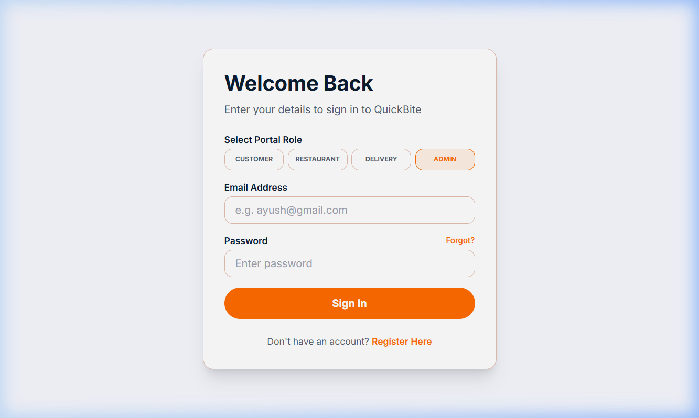
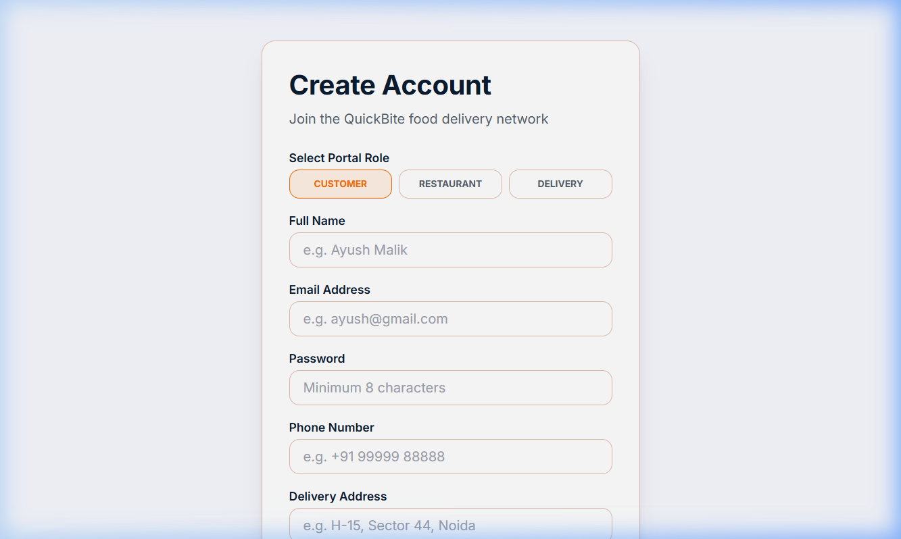
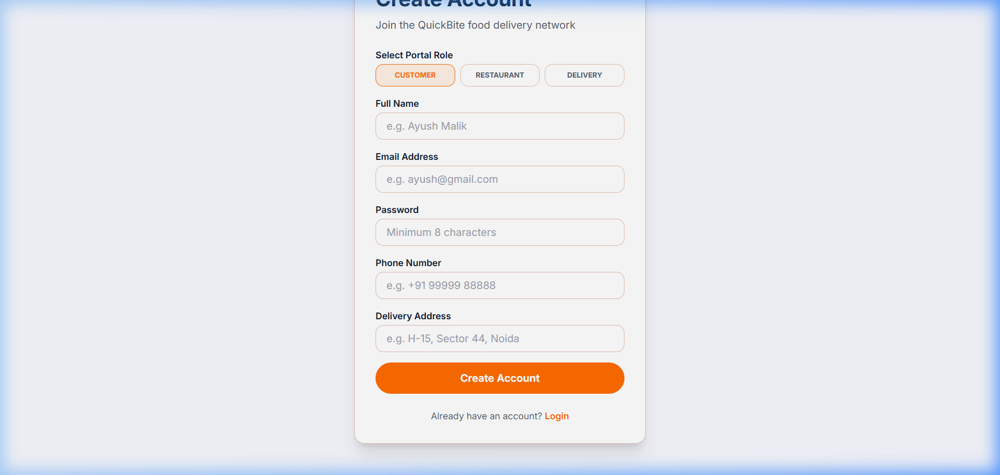

# 🍔 QuickBite – Enterprise Food Delivery Platform

QuickBite is a scalable full-stack food delivery platform inspired by Swiggy, Zomato, and Uber Eats. It provides a complete ecosystem for Customers, Restaurants, Delivery Partners, and Administrators with secure authentication, real-time order tracking, QR-based payments, and role-based dashboards.

---

# 📸 Application Preview

## Home Page



---

## Multi-Role Login





---

## Registration





---

# 🚀 Features

### Customer

- User Registration & Login
- Restaurant Discovery
- Search & Filters
- Cart Management
- QR Payment
- Order Tracking
- Google Maps Integration
- Wallet
- Coupons
- Order History
- Reviews & Ratings

### Restaurant

- Restaurant Dashboard
- Menu Management
- Inventory Management
- Order Management
- Revenue Analytics
- UPI Configuration

### Delivery Partner

- Delivery Dashboard
- Order Assignment
- Live Tracking
- Earnings Dashboard
- Delivery History

### Admin

- User Management
- Restaurant Management
- Delivery Partner Management
- Reports & Analytics
- Order Monitoring
- Complaint Management

---

# 🛠 Tech Stack

## Frontend

- React 19
- TypeScript
- Vite
- Tailwind CSS
- Redux Toolkit
- TanStack Query
- React Router
- Lucide Icons

## Backend

- Java 17
- Spring Boot 3
- Spring Security
- Spring Data JPA
- Hibernate
- JWT Authentication
- WebSocket
- RabbitMQ
- Redis
- MySQL

---

# 📁 Project Structure

```
QuickBite
│
├── Frontend/
│
├── backend/
│
├── screenshots/
│
└── README.md
```

---

# ⚙️ Running the Project

## Backend

```bash
cd backend
./mvnw spring-boot:run
```

Backend runs on:

```
http://localhost:8080
```

---

## Frontend

```bash
cd Frontend
npm install
npm run dev
```

Frontend runs on:

```
http://localhost:5173
```

---

# 🗄 Database

MySQL

```
Database Name: quickbite
```

Configure your database credentials in:

```
backend/src/main/resources/application.properties
```

---

# 📖 API Documentation

Swagger UI

```
http://localhost:8080/swagger-ui/index.html
```

---

# 🔮 Future Enhancements

- Razorpay Integration
- Email Notifications
- SMS Notifications
- Docker Deployment
- Kubernetes
- CI/CD Pipeline
- Elasticsearch Search
- Mobile Application

---

# 👨‍💻 Author

**Ayush Malik**

B.Tech CSE | Java Full Stack Developer

GitHub: https://github.com/ayussh176